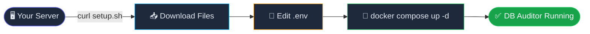
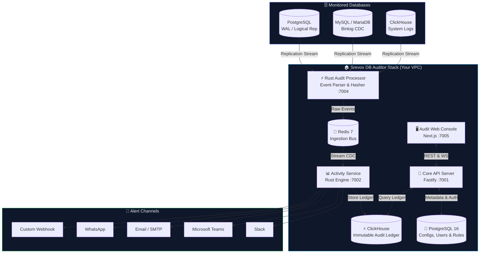
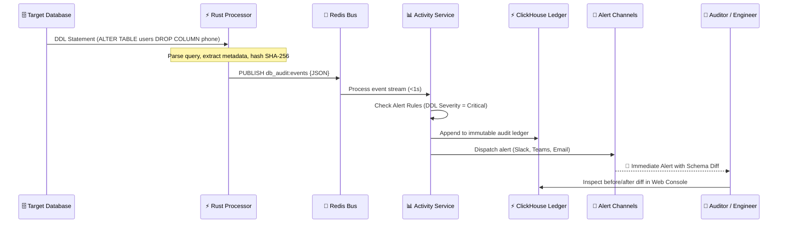
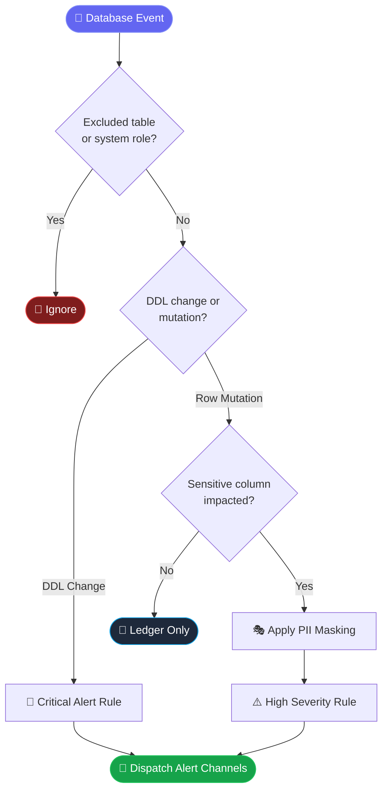
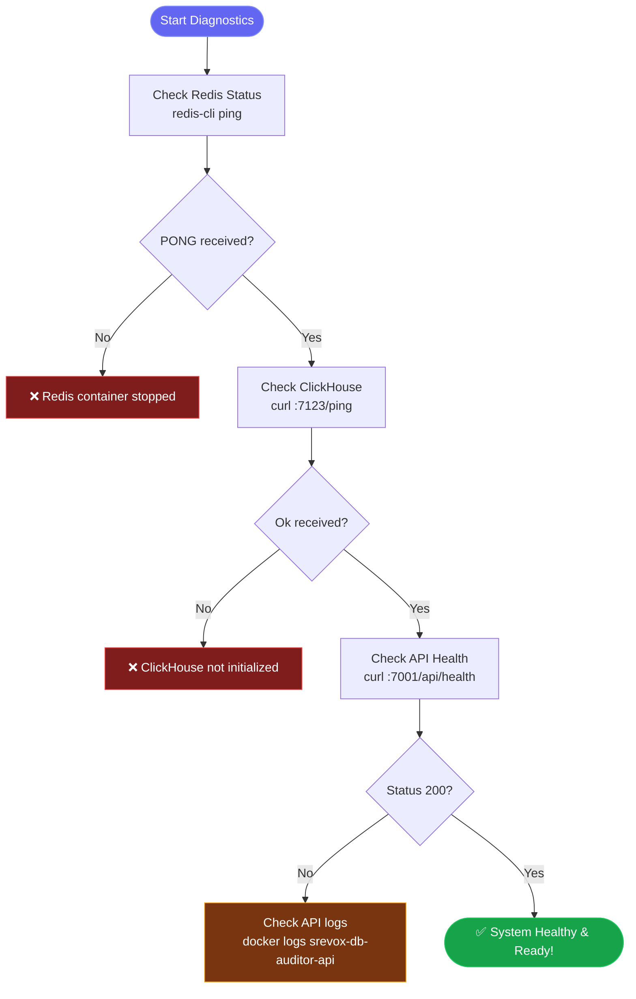

<div align="center">

<br/>


<br/>

# ⚡ Srevox DB Auditor

### **Continuous Database Audit, DDL Change Tracking & Security Compliance.**

*Real-time PostgreSQL, MySQL, and ClickHouse audit log streaming, schema change detection, privilege escalation monitoring, and cryptographic ledger verification — fully self-hosted.*

<br/>

[](https://hub.docker.com/u/akshatsaini08)
[](#-license)
[](https://www.rust-lang.org)
[](https://nodejs.org)
[](https://www.typescriptlang.org)
[](https://helm.sh)

<br/>

> 🐳 **No clone needed. Just Docker + a single command.**  
> Built for on-prem, bare-metal, air-gapped corporate VPCs, and modern cloud environments.

<br/>

[🚀 Quick Start](#-quick-start--no-clone-needed) · [☸️ Helm Deployment](#%EF%B8%8F-kubernetes-installation-via-helm-chart-v001) · [🏗️ Architecture](#%EF%B8%8F-architecture) · [🔌 Connect Database](#-connect-your-database) · [🔔 Alert Channels](#-alert-channels-setup) · [⚙️ Configuration](#%EF%B8%8F-environment-variables)

</div>

---

## 🌟 Why Srevox DB Auditor?

| Traditional Database Logging | Srevox DB Auditor |
|---|---|
| 📜 Massive, unindexed text logs across servers | 🔍 Structured audit ledger with visual before/after row diffs |
| ⚠️ Silent schema drift (untracked `ALTER`, `DROP`) | ⚡ Sub-second DDL alerts directly to Slack, Teams & Webhooks |
| 🔓 Sensitive PII & plaintext credentials leaked | 🛡️ Automated zero-trust PII masking before persistence |
| 📝 Easily modified or purged by bad actors | 🔐 Cryptographic SHA-256 tamper-evident verification chains |
| 🐢 Manual, painful compliance reporting (SOC2/HIPAA) | 📊 Instant compliance-ready audit trails & exportable reports |
| ☁️ Expensive SaaS with database credentials exposed | 🔒 100% self-hosted inside your VPC — zero data leakage |

---

## ✨ Feature Highlights

<table>
<tr>
<td width="50%">

**🔍 Detection & DDL Tracking**
- ⚡ Sub-second DDL change tracking (`CREATE`, `ALTER`, `DROP`)
- 🔔 Instant alerts to Slack, Teams, Email, WhatsApp, Webhooks
- 🛡️ Noise filtering: ignore automated migration tools & heartbeats
- 🏷️ Per-database, table, and user-level classification

</td>
<td width="50%">

**🔐 Cryptographic Audit & Ledger**
- ⛓️ SHA-256 cryptographic hash-chained audit records
- 🔎 Visual before/after column and row diff view
- 🎭 Automated PII masking for credentials, cards & secrets
- ⏱️ Configurable automated retention & archival policies

</td>
</tr>
<tr>
<td width="50%">

**🏗️ Enterprise Architecture**
- 🐘 Native support for PostgreSQL, MySQL, ClickHouse, TiDB
- 🦀 Blazing-fast Rust ingest processor for high-throughput CDC
- 🐳 Single-command Docker Compose stack
- ☸️ Official Helm Chart for Kubernetes (`EKS`, `GKE`, `AKS`, `k3s`)

</td>
<td width="50%">

**👥 Team & Compliance Control**
- 👤 Role-based access control (Admin, Auditor, Viewer)
- 📊 Interactive compliance dashboard for SOC2, HIPAA, GDPR
- 📜 Immutable event search with sub-second ClickHouse queries
- 🔑 JWT-secured API & AES-256-GCM encrypted configs at rest

</td>
</tr>
</table>

---

## 🚀 Quick Start — No Clone Needed

### Prerequisites

```
✅ Docker (v24+)
✅ Docker Compose (v2+)
❌ No database migration experience needed
❌ No code to clone or compile
```

### Step-by-Step Setup



### ☸️ Kubernetes Installation via Helm Chart (v0.0.1)

If you are running in Kubernetes (`EKS`, `GKE`, `AKS`, `minikube`, `k3s`), deploy the official Helm Chart:

```bash
# 1. Add official Srevox DB Auditor Helm repository
helm repo add srevox-db-auditor https://raw.githubusercontent.com/Akshatsainiaks/srevox-db-auditor/main/charts
helm repo update

# 2. Install Srevox DB Auditor via Helm
helm install srevox-db-auditor srevox-db-auditor/srevox-db-auditor   --namespace srevox-db-auditor --create-namespace   --set postgres.password="MySecurePassword123!"

# 3. Upgrade via Helm (Zero downtime)
helm upgrade srevox-db-auditor srevox-db-auditor/srevox-db-auditor   --namespace srevox-db-auditor --reuse-values

# 4. Rollback via Helm (1-Click revert)
helm rollback srevox-db-auditor 1 --namespace srevox-db-auditor
```

---

### 🐳 Docker Compose Deployment

**1️⃣ One-command automated setup**

```bash
curl -fsSL https://raw.githubusercontent.com/Akshatsainiaks/srevox-db-auditor/main/setup.sh | bash
```

**2️⃣ Configure your environment**

```bash
cd srevox-db-auditor && nano .env
```

```env
# ── Core Security & Database ─────────────────────────────────────
POSTGRES_PASSWORD=your_secure_password
BACKEND_SECRET_KEY=any_random_32_char_string_here__   # min 32 chars
ENCRYPTION_KEY=exactly_32_chars_here____________       # exactly 32 chars

# ── Service Endpoints ────────────────────────────────────────────
NEXT_PUBLIC_API_URL=http://YOUR_SERVER_IP:7001
API_URL=http://api:7001
FRONTEND_URL=http://YOUR_SERVER_IP:7005
```

**3️⃣ Launch stack**

```bash
docker compose up -d
```

| Service | Port | URL | Default Credentials |
|---|---|---|---|
| 🖥️ **Web Console** | `7005` | `http://YOUR_SERVER_IP:7005` | `admin@srevox.local` / `admin123` |
| 🔌 **Core API** | `7001` | `http://YOUR_SERVER_IP:7001` | JWT-Secured |
| 📊 **Activity Service** | `7002` | `http://YOUR_SERVER_IP:7002` | Rust Microservice |
| ⚙️ **Audit Control** | `7003` | `http://YOUR_SERVER_IP:7003` | Internal Engine |
| ⚡ **Audit Processor** | `7004` | `http://YOUR_SERVER_IP:7004` | Rust CDC Streamer |
| 🐘 **Internal PostgreSQL**| `7432` | `YOUR_SERVER_IP:7432` | Config & Metadata |
| ⚡ **ClickHouse Ledger** | `7123` | `http://YOUR_SERVER_IP:7123` | Audit Log Storage |

> ⚠️ **Change the default admin password immediately upon first login via Settings → Security.**

---

## 🏗️ Architecture

### System Topology



### Real-Time DDL & Mutation Detection Flow



### Alert Rule Evaluation



---

## 🔌 Connect Your Database

Connecting an external database takes less than 2 minutes.

### 1. PostgreSQL (WAL / Logical Replication)

Ensure logical decoding is enabled in `postgresql.conf`:

```ini
wal_level = logical
max_replication_slots = 10
max_wal_senders = 10
```

Create a dedicated audit user:

```sql
CREATE USER srevox_auditor WITH PASSWORD 'your_secure_password' REPLICATION;
GRANT CONNECT ON DATABASE production TO srevox_auditor;
GRANT USAGE ON SCHEMA public TO srevox_auditor;
GRANT SELECT ON ALL TABLES IN SCHEMA public TO srevox_auditor;
```

In the Srevox Web Console: Go to **Databases → Add Database → PostgreSQL** and input your connection string.

### 2. MySQL / MariaDB (Binlog CDC)

Ensure row-based binlogging is enabled in `my.cnf`:

```ini
server-id = 1
log_bin = /var/log/mysql/mysql-bin.log
binlog_format = ROW
binlog_row_image = FULL
```

Grant replication privileges:

```sql
CREATE USER 'srevox_auditor'@'%' IDENTIFIED BY 'your_secure_password';
GRANT REPLICATION SLAVE, REPLICATION CLIENT, SELECT ON *.* TO 'srevox_auditor'@'%';
FLUSH PRIVILEGES;
```

---

## 🔔 Alert Channels Setup

Configure alerting rules to notify your team when critical DDL mutations or privilege escalations occur:

<details>
<summary><b>💬 Microsoft Teams Setup</b></summary>

```
webhook_url → https://your-org.webhook.office.com/webhookb2/...
```
*How to get:* In your Teams Channel → `⋯ More` → `Connectors` → `Incoming Webhook`.
</details>

<details>
<summary><b>🟢 Slack Setup</b></summary>

```
webhook_url → https://hooks.slack.com/services/T.../B.../...
```
*How to get:* Navigate to [api.slack.com](https://api.slack.com) → *Your Apps* → *Incoming Webhooks* → *Add New Webhook*.
</details>

<details>
<summary><b>📧 Email / SMTP Setup</b></summary>

```
SMTP Host    → smtp.mailgun.org (or smtp.gmail.com)
SMTP Port    → 587
SMTP User    → alerts@yourcompany.com
SMTP Pass    → Your SMTP password / Google App Password
To           → security-oncall@yourcompany.com
```
</details>

<details>
<summary><b>📱 WhatsApp (via Twilio)</b></summary>

```
account_sid → ACxxxxxxxxxxxxxxxxxxxxxxxxxxxxxxxx
auth_token  → your_auth_token
from        → whatsapp:+14155238886
to          → whatsapp:+1234567890
```
</details>

<details>
<summary><b>🔗 Custom Webhook</b></summary>

```
url     → https://internal-siem.yourcompany.com/v1/alerts
headers → {"Authorization": "Bearer SIEM_SECRET_TOKEN"}
```
</details>

---

## ⚙️ Environment Variables

### Required Variables

| Variable | Description | Example |
|---|---|---|
| `POSTGRES_PASSWORD` | Internal PostgreSQL password | `s3cur3p@ss!` |
| `BACKEND_SECRET_KEY` | JWT signing secret (min 32 chars) | `my_super_secret_jwt_key_32chars!` |
| `ENCRYPTION_KEY` | AES-256-GCM database encryption key (**exactly 32 chars**) | `exactlythirtytwocharactershere!` |
| `API_URL` | Internal API server URL for docker network | `http://api:7001` |
| `NEXT_PUBLIC_API_URL` | Public browser API URL | `http://YOUR_SERVER_IP:7001` |
| `FRONTEND_URL` | Web console URL for CORS verification | `http://YOUR_SERVER_IP:7005` |

### Optional Alerting Variables

| Variable | Description | Default |
|---|---|---|
| `SMTP_HOST` | Hostname for SMTP alerts | *(Optional)* |
| `SMTP_PORT` | SMTP port | `587` |
| `SMTP_USER` | SMTP username | *(Optional)* |
| `SMTP_PASS` | SMTP password | *(Optional)* |
| `TWILIO_ACCOUNT_SID`| Twilio Account SID for SMS/WhatsApp | *(Optional)* |
| `TWILIO_AUTH_TOKEN` | Twilio Auth Token | *(Optional)* |

---

## 🐳 Docker Images

Images are published to both GitHub Container Registry and Docker Hub:

| Service | GitHub Container Registry (GHCR) | Docker Hub |
|---|---|---|
| 🔌 **API Server** | `ghcr.io/akshatsainiaks/srevox-db-auditor-api:v0.0.1` | `akshatsaini08/srevox-db-auditor-api:v0.0.1` |
| 🖥️ **Web Console** | `ghcr.io/akshatsainiaks/srevox-db-auditor-frontend:v0.0.1` | `akshatsaini08/srevox-db-auditor-frontend:v0.0.1` |
| 📊 **Activity Service** | `ghcr.io/akshatsainiaks/srevox-db-auditor-activity:v0.0.1` | `akshatsaini08/srevox-db-auditor-activity:v0.0.1` |

---

## 🧪 Testing Your Setup & Health Check

### Health Check Workflow



**Verify API Health:**
```bash
curl -f http://localhost:7001/api/health
# Expected: {"status":"healthy"}
```

**Verify ClickHouse Ledger Connectivity:**
```bash
curl -f http://localhost:7123/ping
# Expected: Ok.
```

### Troubleshooting Guide

| Symptom | Probable Cause | Resolution |
|---|---|---|
| Unable to log in with `admin@srevox.local` | Database migrations still executing | Wait 10 seconds or check `docker compose logs api` |
| "Failed to connect to database" | Target DB firewall or pg_hba.conf restriction | Whitelist your Srevox DB Auditor host IP in `pg_hba.conf` |
| DDL changes not showing up | WAL level not set to `logical` | Set `wal_level = logical` in PostgreSQL and restart PostgreSQL |
| Alerts not received | No channel attached to active alert rule | Web Console → Alert Rules → Attach Slack/Teams/Email channel |
| Docker Hub build fails with insufficient scopes | PAT token missing write scopes | Generate Docker Hub PAT with `Read, Write, Delete` permissions |

---

## 🔐 Security & Compliance

- 🛡️ **Zero-Trust Network Isolation**: Runs entirely inside your VPC, private cloud, or air-gapped on-prem network.
- 🔑 **Cryptographic Immutability**: Every mutation entry is signed with a SHA-256 hash chaining mechanism to prevent tampering.
- 🔒 **Data Encryption at Rest**: Target database credentials and sensitive channel tokens are encrypted with `AES-256-GCM`.
- 🎭 **Automated PII Redaction**: Credit cards, API tokens, passwords, and SSNs are automatically redacted before persistence.
- 📋 **Compliance Ready**: Built to satisfy audit logging standards for **SOC 2 Type II**, **HIPAA**, **PCI-DSS**, and **ISO 27001**.

---

## 📄 License

All rights reserved. Srevox DB Auditor is proprietary software. The configurations, deployment files, and setup scripts provided in this repository are for personal or internal company self-hosted use. Commercial redistribution or managed-service offerings require a commercial license.

---

<div align="center">

**Built for teams that protect their data.**

*No cloud dependencies. No SaaS telemetry. 100% data sovereignty.*

⚡ **Srevox DB Auditor** — Continuous Database Audit & DDL Intelligence.

[🐛 Issues](https://github.com/Akshatsainiaks/srevox-db-auditor/issues) · [⭐ Star](https://github.com/Akshatsainiaks/srevox-db-auditor)

</div>
